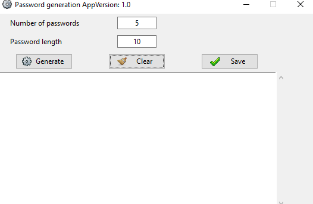
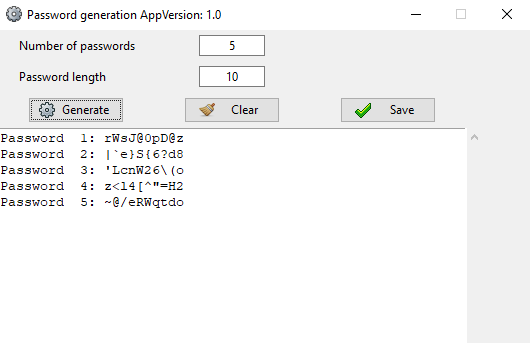

# Password Generation App

## Description

✍This application is designed to generate secure passwords. Users can specify the number of passwords and their length. It also provides features to display, clear, and save the generated passwords.

## Features
- Generate multiple passwords based on user-specified criteria.
- Clear the displayed passwords.
- Save the generated passwords to a file.

## Usage
- `Number of passwords`: Specify how many passwords to generate.
- `Password length`: Define the length for each password.
- `Generate`: Button to start the password generation.
- `Clear`: Button to clear the text area.
- `Save`: Button to save the generated passwords to a file.

## Tech Stack
- Python
- Tkinter for the GUI
- Random and string libraries for password creation

## Version
Version 1.0

## Iconography
Icons are used for the buttons to enhance user interaction.

### Output Screen

- Before Password Generation
#### Before Password
  

- After Password Generation
#### AFTER Password
   